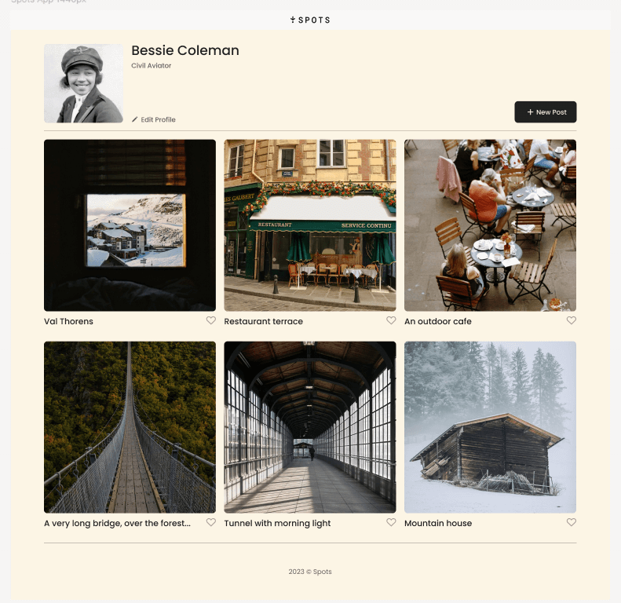
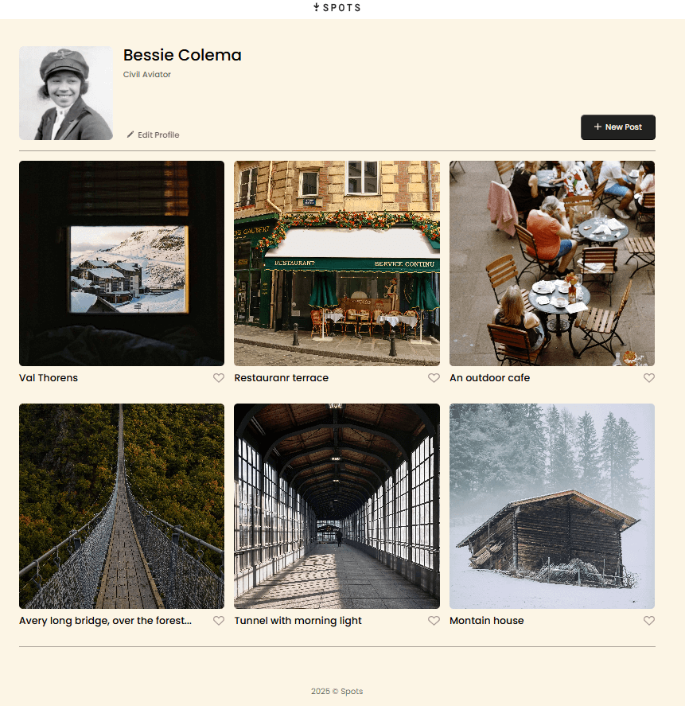
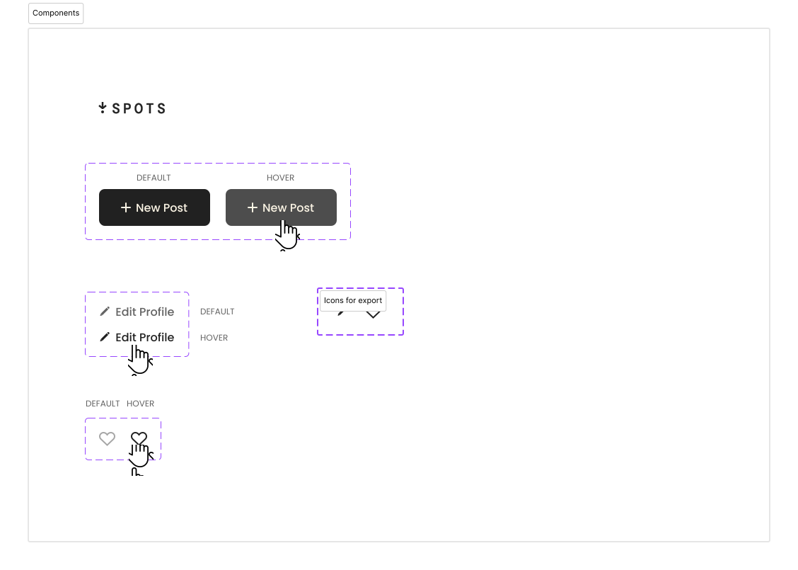

# Spots

## Intro

This project is a simple, responsive web page designed to showcase user profiles and cards, such as posts or media items. The design and functionality focus on clean asthetics and responsiveness, making it suitable for various devices.

## Features

- **Responsive Design:** The layout adapts seamlessly to different screen sizes.
- **User profile section:** Displays user avatar, name, description, and action buttons.
- **Cards Sections:** Alist of media items with titles and interactive buttons.
- **Figma Base Design:** The design was planned and portotyped in Figma for clarity and precision.
- **HTML and CSS:** The porject is built enterely with semantic HTML and modern CSS.

## Technologies Used

1. **Figma:** Used to conceptualize and finalize the design.
2. **HTML:** Structure and semantic elements of the web page.
3. **CSS:** Styling for layout, typography, and responsiveness.

**Figma**

- [Link to the project on Figma](https://www.figma.com/file/BBNm2bC3lj8QQMHlnqRsga/Sprint-3-Project-%E2%80%94-Spots?type=design&node-id=2%3A60&mode=design&t=afgNFybdorZO6cQo-1)

**Figma model** 
**Final Result** 
**Hover set up** 

## Author

**Diego Alejandro Navas Murcia** / **TripleTen Student**
